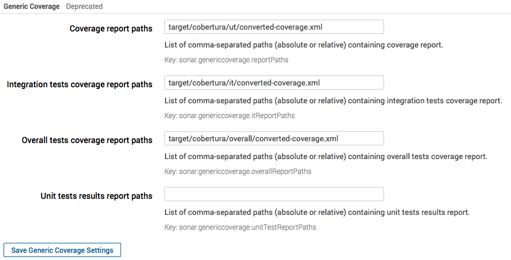

# Qualinsight Cobertura Maven plugin

This project provides a Maven plugin that runs Cobertura instrumentation and reporting as well as report transformation to SonarQube generic test coverage format.

## Rationale ##

This plugin was written for the following four reasons :

* [``cobertura-maven-plugin``](http://www.mojohaus.org/cobertura-maven-plugin/) generates a coverage report mixing both UT and IT coverage. As a result UT and IT coverage cannot be separated in SonarQube.
* [``cobertura-maven-plugin``](http://www.mojohaus.org/cobertura-maven-plugin/) relies on [Cobertura](https://github.com/cobertura/cobertura) executables and runs tests in his own lifecycle. As a result all tests must be run twice.
* [SonarQube cobertura plugin](http://docs.sonarqube.org/display/PLUG/Cobertura+Plugin) only takes a single input report. As a result UT and IT coverage cannot be separated in SonarQube.
* Using another coverage tool such as [Jacoco](https://github.com/jacoco/jacoco) was not an option as Jacoco incompatibility with [PowerMock](https://github.com/jayway/powermock) results in classes having 0% coverage for tests using PowerMock.

After having analyzed different approaches to tackle these issues, I decided to provide a Mojo (Maven plugin) that allows coverage computation without having to run twice unit and integration tests, and that is able to convert cobertura xml reports to [SonarQube Generic Test Coverage](http://docs.sonarqube.org/display/PLUG/Generic+Test+Coverage) plugin format in order to have coverage information for both UT and IT. 

## Features ##

* Separate instrumentation of unit and integration tests
* Generation of unit, integration and overall coverage reports
* Coverage report conversion to SonarQube generic coverage format
* Seamless integration with your regular reactor build (single tests execution, simple configuration)

## Plugin goals and options ##

In order to use the ``qualinsight-mojo-cobertura-core`` plugin, goals must be configured for both cobertura code instrumentation and reporting.

### Instrumentation ###

The following two instrumentation goals are available.

| Goal          | Default Phase        | Description                                                                                             |
|---------------|----------------------|---------------------------------------------------------------------------------------------------------|
| instrument-ut | PROCESS_TEST_CLASSES | Instruments project classes in order to enable coverage calculation during unit tests execution.        |
| instrument-it | PRE_INTEGRATION_TEST | Instruments project classes in order to enable coverage calculation during integration tests execution. |

These two instrumentation goals have the following configuration options.

|Option                      | Default value                                           | required ? | Description                                                  |
|----------------------------|---------------------------------------------------------|------------|--------------------------------------------------------------|
|classesDirectoryPath        |``${project.build.directory}/classes/``                  | false      | Path where compiled classes are located.                     |
|backupClassesDirectoryPath  |``${project.build.directory}/cobertura/backup-classes/`` | false      | Path where compiled classes will be backuped.                |
|destinationDirectoryPath    |``${project.build.directory}/classes/``                  | false      | Path where instrumented classes will be generated.           |
|ignoreTrivial               |``true``                                                 | false      | Excludes constructors/methods that contain one line of code. |
|failOnError                 |``false``                                                | false      | Should the build fail on error ?                             |
|threadsafeRigorous          |``false``                                                | false      | Make Cobertura use a threadsafe code instrumentation ?       |
|encoding                    |``UTF-8``                                                | false      | File encoding used for classes compilation.                  |
|ignoreMethodAnnotation      |                                                         | false      | Excludes [annotated methods from instrumentation] (https://github.com/cobertura/cobertura/wiki/Coverage-Annotations). |
|ignoreClassAnnotation       |                                                         | false      | Excludes [annotated classes from instrumentation] (https://github.com/cobertura/cobertura/wiki/Coverage-Annotations). |

### Reporting ###

The following three reporting goals are available.

| Goal                        | Default Phase         | Description                                                                                                                   |
|-----------------------------|-----------------------|-------------------------------------------------------------------------------------------------------------------------------|
| ``report-ut-coverage``      | PREPARE_PACKAGE       | Reports unit test coverage results, converts report to SonarQube generic coverage format and restores backuped classes.       |
| ``report-it-coverage``      | POST_INTEGRATION_TEST | Reports integration test coverage results, converts report to SonarQube generic coverage format and restores backuped classes.|
| ``report-overall-coverage`` | VERIFY                | Merges unit and integration coverage results, then converts report to SonarQube generic coverage format.                      |

All three goals share the following configuration options.

| Option                    | Default value                     | required ? | Description                                                |
|---------------------------|-----------------------------------|------------|------------------------------------------------------------|
| baseDirectoryPath         | ``${project.basedir}/src/main/``  | false      | Path where source code is located.                         |
| encoding                  | ``UTF-8``                         | false      | File encoding used for classes compilation.                |
| format                    | ``xml``                           | false      | Output format (xml|html).                                  |
| convertToSonarQubeOutput  | ``true``                          | false      | Should the report be converted to SonarQube generic coverage format ? (requires 'xml' format) |

The ``report-ut-coverage`` and ``report-it-coverage`` report goals have the following additional configuration options.

| Option                          | Default value                                              | required ? | Description                                                |
|---------------------------------|------------------------------------------------------------|------------|------------------------------------------------------------|
| classesDirectoryPath            | ``${project.build.directory}/classes/``                    | false      | Path where instrumented classes are located.               |
| backupClassesDirectoryPath      | ``${project.build.directory}/cobertura/backup-classes/``   | false      | Path where backuped classes are located.                   |
| destinationDirectoryPath        | ``${project.build.directory}/cobertura/(ut|it)``           | false      | Path where generated (ut|it) reports will be placed.       |
| calculateMethodComplexity       | ``false``                                                  | false      | Should reports include cyclomatic complexity calculation ? |

The ``report-overall-coverage`` report goal has the following configuration additional options.

| Option                          | Default value                                              | required ? | Description                                                |
|---------------------------------|------------------------------------------------------------|------------|------------------------------------------------------------|
| baseUtDirectoryPath             | ``${project.build.directory}/cobertura/ut/``               | false      | Path where ut coverage report is located.                  |
| baseItDirectoryPath             | ``${project.build.directory}/cobertura/it/``               | false      | Path where it coverage report is located.                  |
| destinationDirectoryPath        | ``${project.build.directory}/cobertura/overall/``          | false      | Path where generated overall report will be placed.        |

## Plugin usage ##

The latest version of the plugin can be retrieved from [Maven central](https://repo1.maven.org/maven2/com/qualinsight/mojo/cobertura/qualinsight-mojo-cobertura-core/). A full usage example is available (see [qualinsight-mojo-cobertura-example](https://github.com/pawlakm/qualinsight-mojo-cobertura-example).)

**Note**: the plugin is compatible with Java 1.6 (since version 1.0.5)

### Step 1: declare plugin ###

The declaration of the plugin is as easy as follows.

```
  <plugin>
    <groupId>com.qualinsight.mojo.cobertura</groupId>
    <artifactId>qualinsight-mojo-cobertura-core</artifactId>
    <version>${plugin.qualinsight-mojo-cobertura-core.version}</version>
    <executions>
      <execution>
        <id>instrument-ut</id>
        <goals>
          <goal>instrument-ut</goal>
        </goals>
      </execution>
      <execution>
        <id>instrument-it</id>
        <goals>
          <goal>instrument-it</goal>
        </goals>
      </execution>
      <execution>
        <id>report-ut-coverage</id>
        <goals>
          <goal>report-ut-coverage</goal>
        </goals>
      </execution>
      <execution>
        <id>report-it-coverage</id>
        <goals>
          <goal>report-it-coverage</goal>
        </goals>
      </execution>
      <execution>
        <id>report-overall-coverage</id>
        <goals>
          <goal>report-overall-coverage</goal>
        </goals>
      </execution>
    </executions>
  </plugin>
```

### Step 2: add a test dependency to Cobertura ###

In order to allow instrumented classes to report coverage during tests execution, Cobertura must be added as a ``test`` dependency.

```
  <dependency>
    <groupId>net.sourceforge.cobertura</groupId>
    <artifactId>cobertura</artifactId>
    <version>2.1.1</version>
    <scope>test</scope>
  </dependency>
```

### Step 3: run your tests ###

Run your build with your regular UT and IT tests execution configuration. That's it!

## Report conversion to SonarQube generic test coverage format

By default, the ``convertToSonarQubeOutput`` option of the ``report-ut-coverage``, ``report-it-coverage`` and ``report-overall-coverage`` goals is set to ``true``. This results in the conversion of regular Cobertura ``coverage.xml`` reports to a format the [SonarQube Generic Test Coverage](http://docs.sonarqube.org/display/PLUG/Generic+Test+Coverage) plugin for SonarQube is able to read. This allows you then to directly use your Cobertura UT and IT coverage reports in SonarQube while keeping UT and IT coverage information separated.

The name of the converted coverage report file is ``converted-coverage.xml`` and is located in the directory specified by the ``destinationDirectoryPath`` option of the reporting goals, i.e: 

* ``${project.build.directory}/cobertura/ut/converted-coverage.xml`` for UT coverage
* ``${project.build.directory}/cobertura/it/converted-coverage.xml`` for IT coverage 
* ``${project.build.directory}/cobertura/overall/converted-coverage.xml`` for Overall coverage 

These reports can then be imported [SonarQube Generic Test Coverage](http://docs.sonarqube.org/display/PLUG/Generic+Test+Coverage) plugin for SonarQube. Here is a screenshot of how the plugin should be configured:



As you can see on the screenshot, currently the SonarQube Generic Test Coverage plugin cannot take an overall coverage report as input. As soon as [SONARCOVRG-14](https://jira.sonarsource.com/browse/SONARCOVRG-14) is fixed (see [pull request](https://github.com/SonarSource/sonar-generic-coverage/pull/5)), you'll be able to configure overall coverage input file as well.

**Important notes** :

* When using the SonarQube Generic Test Coverage plugin for SonarQube in order to import Cobertura coverage data, you need to uninstall the [Cobertura Plugin] (http://docs.sonarqube.org/display/PLUG/Cobertura+Plugin) prior to executing an analysis, otherwise you'll encounter collisions (and thus analysis failures) between metrics reported by the two plugins as the same metric cannot be reported twice.
* For the same reason, when using Cobertura in order to report Coverage metrics, you need to forbid the execution of Jacoco coverage reports or other coverage report tool.

## Default directory structure ##

The default directory structure created by the plugin is the following:

```
${project.build.directory}/cobertura/
   |- backup-classes/
   |- it
   |   |- cobertura.ser
   |   |- coverage.xml
   |   |- converted-coverage.xml
   |   `- instrumented-classes/
   |- overall
   |   |- cobertura.ser
   |   |- coverage.xml
   |   `- converted-coverage.xml
   `- ut
       |- cobertura.ser
       |- coverage.xml
       |- converted-coverage.xml
       `- instrumented-classes/ 
```

## How does the qualinsight-mojo-cobertura-core plugin compare to the cobertura-maven-plugin ? ##

Unlike the [``cobertura-maven-plugin``](http://www.mojohaus.org/cobertura-maven-plugin/) the ``qualinsight-mojo-cobertura-core`` plugin does not run UT and IT tests in his own lifecycle and does not use Cobertura executable, but directly calls Cobertura API to instrument code before tests execution. 

This allows to calculate coverage during the ``test`` and ``integration-test`` lifecycle phases of your regular reactor build, and to execute tests only once.

Further, the ``qualinsight-mojo-cobertura-core`` plugin is able to convert Cobertura xml reports to SonarQube generic test coverage plugin format to benefit from UT and IT coverage measures separation in SonarQube.

The only limitations of the ``qualinsight-mojo-cobertura-core`` plugin compared to the ``cobertura-maven-plugin`` is that it does not currently have a custom report merging feature (it currently only merges UT and IT reports, you cannot add a list of reports to merge) nor coverage check feature. However these features will be added in a future release)

## Build status


